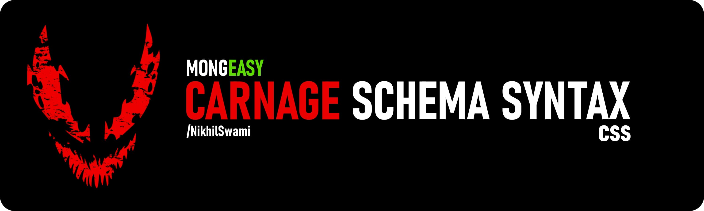

<!-- test comment -->

Mongeasy aims to simplify the process of creating and managing schemas/models in your MEAN/MERN/M(WHATEVER) project using a straightforward syntax for defining the schema
structure. It employs a flag-based declaration and modification language known as CSS (Carnage Schema Syntax). dont worry its only 6 symbols, and you already know 3 of them.

### why use it?

-   easy to use, mongeasy!
-   unlike mongoose no need to import schema, model, then export it to use in other files, just declare and forget. mongeasy handles all that for you.
-   66% shorter code! 3 lines of code in mongeasy = 9 lines of code in mongoose, which eliminates the need to keep a seperate folder `models`. makes code more readable, clean and
    easy to maintain.
-   reverse compatibility, if your crazy use case is not supported by mongeasy, you can still use mongoose syntax, as mongeasy is superset of mongoose.

hello im Nikhil Swami, visit swamix.com

# Install

```bash
npm i mongeasy
pnpm i mongeasy
yarn i mongeasy
bun i mongeasy
#NOTE: bun is 10x faster than npm & 2x faster than pnpm, give it a try
```

# Example:

```javascript
import mongoose from 'mongoose';
import { models, schema } from './index.js';

let Models = models({
    Computer: [
        'name           |String |!|*|#|(3,16)', // ! = unique, * = required, # = index, (3,16) = minlength,maxlength
        'price          |Number |+U|+R|+I', // same as above, +U = unique, +R = required, +I = index
        'madeIn=India   |String |', // ref:CountryNames = reference to another model
        'dateOfPurchase |Date   |*', // Date = Date , * = required
        "color          |String |['red','blue','green']", // ['red','blue','green'] = enum
        'inStock        |Boolean|',
        'storageTemp    |Number |(-10,60)', // (0,) = min no upper limit
        'globalStockQty |Number |(0,)', // (0,) = min, no upper limit // (,100) = no lower limit
    ],
    Employee: [
        'name|String|!|*|#|(3,16)',
        'salary|Number|+R',
        'dateOfJoining|Date|*',
        'designation|String|*',
        'gender|String|["male","female"]',
        'isMarried|Boolean|*',
        'address|String|*',
        'phone|String|*',
    ],
});

console.log(Models);

// Connect to database
mongoose.connect('mongodb://localhost:27017/test', {
    useNewUrlParser: true,
    useUnifiedTopology: true,
});

// add a computer as usual
let c = new Models.Computer({
    name: 'Macbook Pro 2',
    price: 2000 + Math.random() * 1000,
    madeIn: 'India',
    dateOfPurchase: new Date(),
    color: 'red',
    inStock: true,
    storageTemp: 50,
    globalStockQty: 100,
});
c.save();

// exit
setTimeout(() => {
    mongoose.disconnect();
}, 100);
```

# Output

will give you a reference to model "Computer", ie a schema.tree output as follows.

```javascript
tree: {
    name: { type: [Function], required: true, index: true, unique: true },
    price: { type: [Function], required: true },
    madeIn: { type: [Function], default: 'India' },
    dateOfPurchase: { type: [Function] },
    color: { type: [Function], required: true, enum: [Array] },
    _id: { auto: true, type: 'ObjectId' }
}
```

```json
{
    "_id": {
        "$oid": "651cc942ce8673d0245358b7"
    },
    "name": "HP Omen 15",
    "price": 1000,
    "madeIn": "651cc941ce8673d0245358b3",
    "dateOfPurchase": {
        "$date": "2023-10-04T02:09:06.071Z"
    },
    "color": "red",
    "__v": 0
}
```

### **Format:** `<Name>` | `<Type>` | \*`<Modifiers>`

**Name:**

-   the name of field, 😀🥱😴 - emojis also supported

**Type :**

all supported, as we directly pass to Core Library

-   [ Array, Boolean, BigInt, Buffer, Date, Decimal, Decimal128, DocumentArray, Map, Mixed, Number, ObjectId, String, Subdocument, UUID, Oid, Object, Bool, ObjectID ]

**Modifiers:**

The syntax consists of the following elements: Note: "/" means "either option"

-   +U / ! = unique
-   +R / \* = required
-   +I / # = index
-   (0, 999) = min,max
-   ['adam', 'eve'] = enum

## Here's a breakdown of how its used:

-   **`Name`** : This part represents the name of the field you want to define in your schema. It's a required element.
-   **`Type`** : This part specifies the type of the field, and it's also a required element. You can use any of the supported types provided by Mongoose.
-   **`Modifiers`** : These are optional and allow you to add extra attributes or flags to the field. For example, you can use `!` for unique fields, `*` for required fields, and
    `#` for indexed fields.

This CSS-based declaration paradigm aims to provide a simplified way of defining Mongoose schemas, making it easier to work with MongoDB data models.
